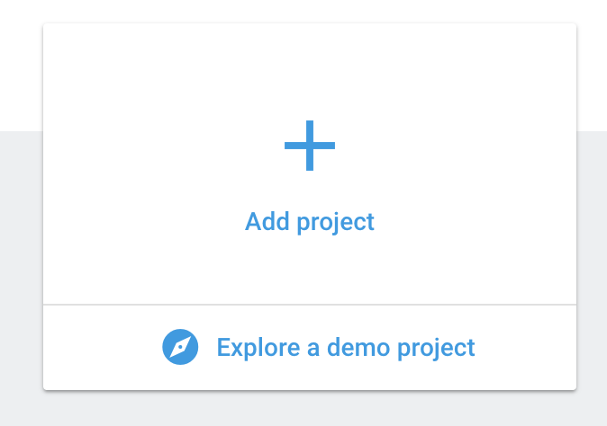
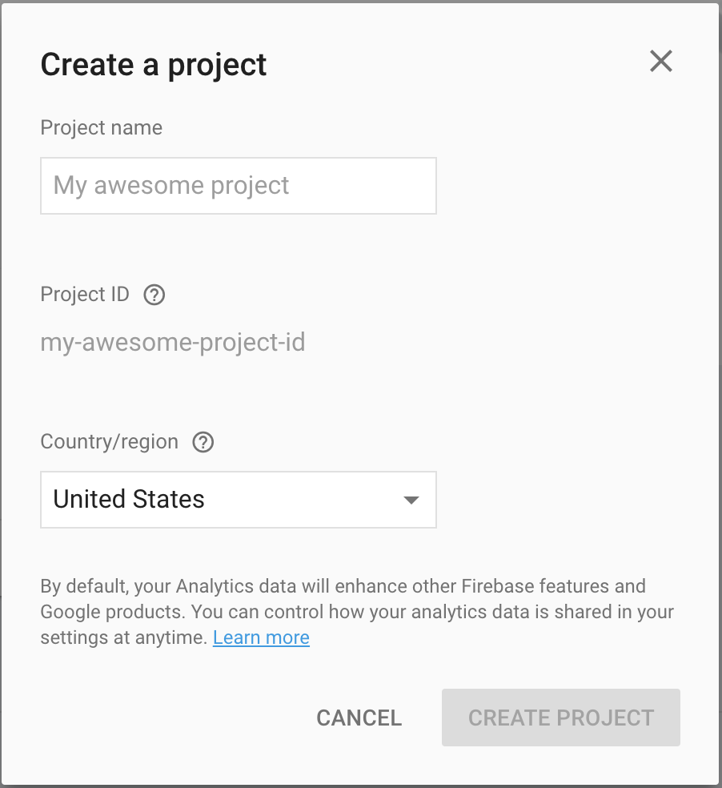
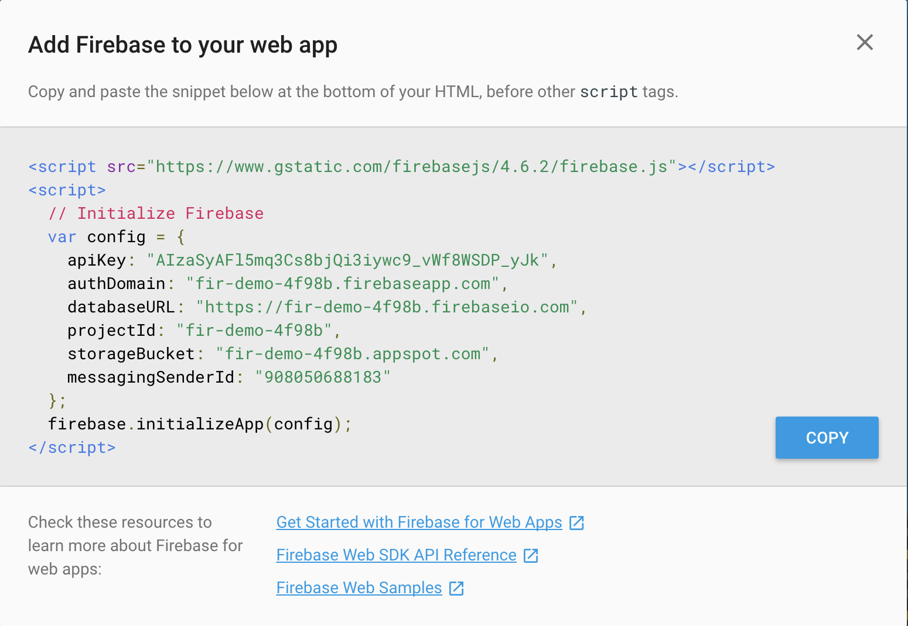
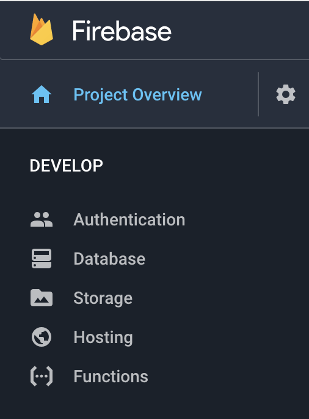
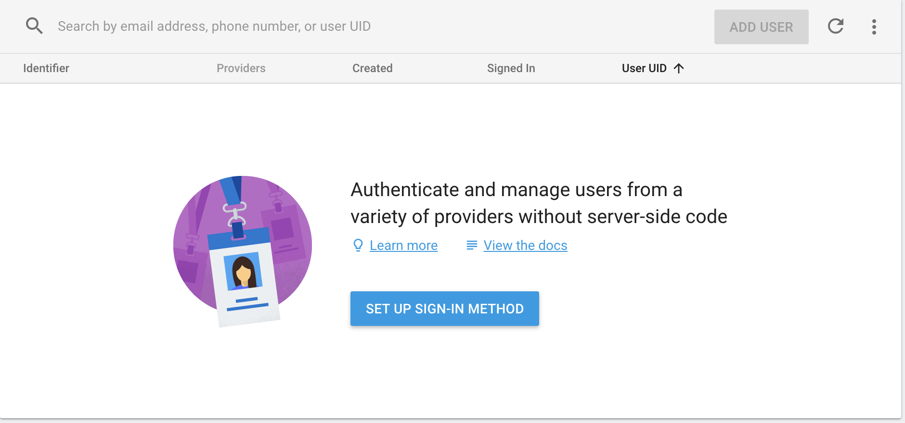
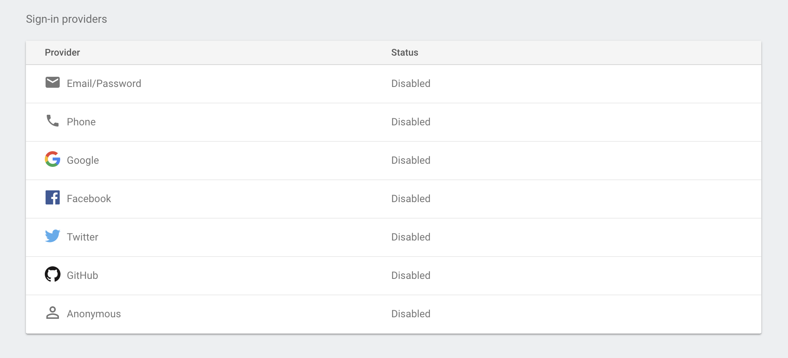
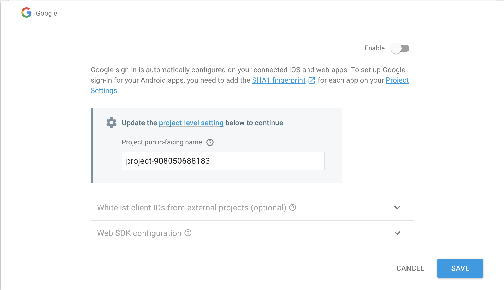

# Firebase

## Setting up Firebase
* Go to [Firebase Website](https://firebase.google.com/)
* Click `Get Started`
* Click `Add project`



* In `Project name` enter [yourname]Testing
* Firebase will randomly create a project ID
* Click `Create Project`
* You will now be taken to the console of your Firebase project


* Click the `Add Firebase to your web app` button


* Click the `copy` button
* This code is what is going to allow your code to use Firebase

## Adding Firebase to Your Code
* Create your `index.html` and a `script.js` files
* In your `index.html` add `<script src="https://www.gstatic.com/firebasejs/4.6.2/firebase.js"></script>` into the head of you html file.
* Now in your javascript file add the code that we copied earlier. **Make sure to not incorporate the script tags**
```js
var config = {
    apiKey: "<API_KEY>",
    authDomain: "<PROJECT_ID>.firebaseapp.com",
    databaseURL: "https://<DATABASE_NAME>.firebaseio.com",
    storageBucket: "<BUCKET>.appspot.com",
    messagingSenderId: "<SENDER_ID>",
  };
  firebase.initializeApp(config);
```

## Enabling Authentication
* Below is the sidebar on the left side of console. We are going to begin with Authentication


* For this demo we will be using Google Authentication
* Click `Authentication` in the sidebar shown above


* Click on the `SET UP SIGN-IN METHOD` button


* You will then see a list of possible sign in providers. We will be using Google so click on that.


* Click on the toggle in the top right corner to enable Google authentication and click `SAVE`

## Adding Authentication to Your Code
### **Important Note**
  * This code will not run locally when you just open the html file. This code must either be deployed or running on a localhost to work

### Lets Get Started

  * First things first, create a button that will allow us to login
  ```html
  <button id="googleLogin" type="button" name="button">Login</button>
  ```

  * In your JS you are going to have to creat a function to allow you to Login
  ```js
  function googleLogin() {
    var provider = new firebase.auth.GoogleAuthProvider();
    firebase.auth().signInWithPopup(provider).then(function(result) {
      // This gives you a Google Access Token. You can use it to access the Google API.
      var token = result.credential.accessToken;
      // The signed-in user info.
      var user = result.user;
    }).catch(function(error) {
      // Handle Errors here.
      var errorCode = error.code;
      var errorMessage = error.message;
      // The email of the user's account used.
      var email = error.email;
      // The firebase.auth.AuthCredential type that was used.
      var credential = error.credential;
    });
  };
  ```
  * What the code above is doing is using firebase to authenticate the user using there google account
  * The login will be done using a popup, which is what the `signInWithPopup` is instructing
  * Your user's information is returned to you in the `results` of the callback function
  * `console.log()` this data to view all the data you receive from the authentication

## Accesing User Information Through Out Your Code
  * Now that you are logged in you are probably going to want to access the users information through out other places in your code. You have 2 ways to do that:
    * You can set the `results` that you get back from the sign in as global variable
    * In each function you want to use the user in you can run the function `firebase.auth().currentUser;` setting that to a variable. This will keep the current user scoped to the current function
